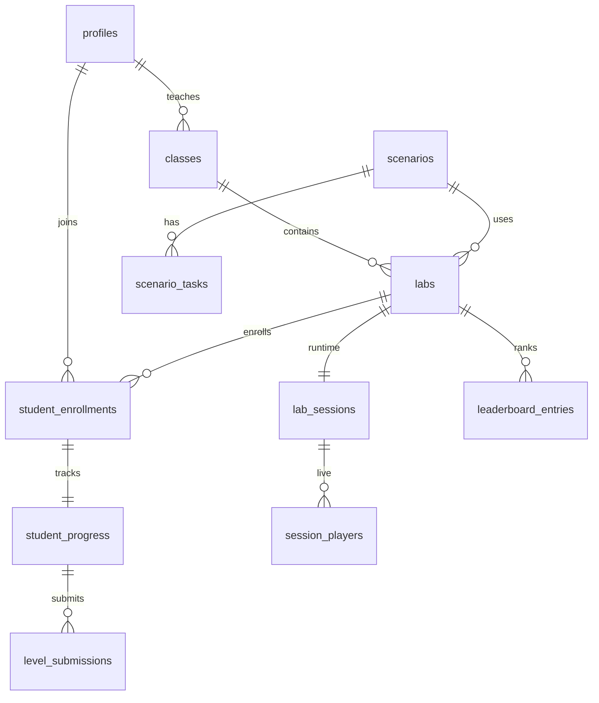

# SimuRep — Supabase Database Schema

This schema mirrors your **Virtual Lab** game (Levels 1–3, PIN sessions, multiplayer, analytics) and your backend requirements document. Calculations will live in **Node/Express** later; Supabase stores authoritative data.

---

## Why Supabase?

| Your requirement | Supabase feature |
|------------------|------------------|
| MongoDB-style collections | PostgreSQL tables + JSONB |
| Real-time leaderboard | **Realtime** on `session_players`, `student_progress` |
| Socket.IO rooms by PIN | Same PIN as `labs.session_pin` → room id; DB + Realtime until Express socket layer |
| Auth later | **Supabase Auth** + `profiles` table |
| Analytics | SQL views / `class_analytics` cache |

---

## Entity relationship (high level)



---

## Table map: your spec → Supabase

| Your collection | Supabase table(s) |
|-----------------|-------------------|
| **USERS** | `auth.users` + `profiles` |
| **LAB SESSIONS** | `labs` + `lab_sessions` |
| **STUDENT PROGRESS** | `student_progress` (+ `student_enrollments`) |
| **SCENARIOS** | `scenarios` + `scenario_tasks` + `task_precedence` |
| Live multiplayer | `session_players` |
| Leaderboard | `leaderboard_entries` |
| Analytics cache | `class_analytics` |
| Audit / API submits | `level_submissions` |

---

## A) `profiles` (users)

| Column | Type | Notes |
|--------|------|--------|
| `id` | UUID | = `auth.users.id` |
| `name` | text | |
| `email` | text | unique |
| `role` | `user_role` | `student` \| `instructor` |
| `created_at` | timestamptz | |

**Until auth is enabled:** backend can use `service_role` and anonymous `player_id` on enrollments.

---

## B) `lab_sessions` + `labs`

**`labs`** — what the instructor creates (matches `Lab` in `classes.ts`):

| Column | Maps from frontend |
|--------|-------------------|
| `session_pin` | `Lab.pin` (6 digits) |
| `template_id` | `Lab.templateId` |
| `lab_config` | JSON: `scenario`, `lineBalancing`, `productionPlanning` |
| `status` | `draft` \| `active` |
| `feedback_from_instructor` | `Lab.feedbackFromInstructor` |

**`lab_sessions`** — runtime (matches `LabLiveSession`):

| Column | Maps from frontend |
|--------|-------------------|
| `session_pin` | same as lab PIN |
| `level3_status` | `idle` \| `waiting` \| `live` \| `ended` |
| `level3_started` | instructor clicked start |
| `total_students` | `computeLiveSessionStats().totalJoined` |
| `waiting_students` | `readyWaiting` |
| `active_students` | playing L1/L2/L3 |
| `current_stage` | `level1` / `level2` / `level3` |

---

## C) `student_progress`

One row per student per lab (your **STUDENT PROGRESS** collection).

| Column | Level | Frontend source |
|--------|-------|-----------------|
| `progress` | all | `StudentProgressLevel` |
| `current_level` | all | 1, 2, 3 |
| `is_waiting_level3` | 3 | `waiting_l3` |
| `efficiency_pct`, `idle_time_sec`, `workstation_count` | 1 | `saveLabPerformanceResult.metrics` |
| `balance_efficiency_pct` | 1/3 | L3 live / breakdown |
| `flow_efficiency_pct`, `backtracking_count`, `transportation_waste` | 2 | `FlowMetrics` |
| `final_score`, `leaderboard_position`, `engineering_rank` | 3 | `NashamaScoreBreakdown` |
| `level1_assignment` | 1 | snapshot JSON for comparison |

---

## D) `scenarios` + tasks

| Column | Your spec |
|--------|-----------|
| `scenario_name` | ✓ |
| `cycle_time_sec` | `cycleTime` |
| `difficulty` | ✓ |
| `scenario_tasks.task_id` | `taskId` |
| `scenario_tasks.task_name` | `taskName` |
| `scenario_tasks.duration_sec` | `duration` |
| `scenario_tasks.category` | `category` |
| `task_precedence` | `dependencies` |

Built-in seeds: **T-shirt (L1/L2)** and **Nashama World Cup (L3)** in `002_seed_builtin_scenarios.sql`.

---

## Socket.IO events → DB writes (later)

| Event | Tables touched |
|-------|----------------|
| `studentJoined` | `student_enrollments`, `student_progress`, `session_players` |
| `studentWaitingLevel3` | `student_progress.progress = waiting_l3` |
| `waitingCountUpdated` | trigger → `lab_sessions` counters |
| `level3Started` | `lab_sessions.level3_status = live` |
| `scoreUpdated` | `session_players`, `student_progress` |
| `leaderboardUpdated` | `leaderboard_entries` or live query |
| `challengeFinished` | `level3_complete`, `leaderboard_entries` |

**Room name:** `session_pin` (e.g. `socket.join('482910')`).

---

## API routes → tables (later Express)

| Route | Primary tables |
|-------|----------------|
| `POST /create-session` | `labs`, `lab_sessions` |
| `POST /join-session` | `student_enrollments`, `student_progress` |
| `POST /level1/submit` | `level_submissions`, `student_progress` |
| `POST /level2/submit` | `level_submissions`, `student_progress` |
| `POST /level3/start` | `lab_sessions` |
| `GET /leaderboard` | `leaderboard_entries` or `session_players` |
| `GET /instructor/analytics` | `class_analytics` + aggregates on `student_progress` |

---

## Setup steps (Supabase)

1. Create a project at [supabase.com](https://supabase.com).
2. **SQL Editor** → run in order:
   - `migrations/001_initial_schema.sql`
   - `migrations/002_seed_builtin_scenarios.sql`
3. **Database → Replication** → enable Realtime for:
   - `session_players`
   - `lab_sessions`
   - `student_progress`
4. **Settings → API** → copy:
   - `Project URL`
   - `anon` key (frontend)
   - `service_role` key (backend only — never in React)
5. Add to frontend `.env` (when ready):

```env
VITE_SUPABASE_URL=https://xxxx.supabase.co
VITE_SUPABASE_ANON_KEY=eyJ...
```

6. Uncomment `on_auth_user_created` trigger in `001` when using Supabase Auth.

---

## What stays in the backend (Node), not in DB

Per your rule **#13**, these engines run in Express services, not React:

| Engine | Reads | Writes |
|--------|-------|--------|
| **Optimization** (L1) | `scenario_tasks`, `cycle_time_sec` | `level_submissions.recommended_solution` |
| **Workflow** (L2) | assignment JSON | flow metrics on `student_progress` |
| **Scoring** (L3) | live assignment | `session_players.total_score` |
| **Leaderboard** | `session_players` | `leaderboard_entries` |
| **Analytics** | `student_progress`, `level_submissions` | `class_analytics` |

---

## Migration from current localStorage

| localStorage key | Target table |
|------------------|--------------|
| `simulab_instructor_classes_v2` | `classes` + `labs` |
| `simulab_student_joined_v1` | `student_enrollments` |
| `simulab_lab_performance_results_v1` | `level_submissions` (level=1) |
| `simulab_live_session_v1_{labId}` | `lab_sessions` + `session_players` |
| `simulab_player_id_v1_{labId}` | `student_enrollments.player_id` |
| `nashama_worldcup_leaderboard_v1` | `leaderboard_entries` |

---

## Next steps

1. Run migrations in Supabase ✅ (you)
2. Scaffold `backend/` with Express + `@supabase/supabase-js`
3. Port `lineBalancingEngine.ts` logic to `backend/optimization/`
4. Replace `liveSessionSync.ts` with Supabase Realtime + Socket.IO
5. Point React to API instead of localStorage (incremental)
